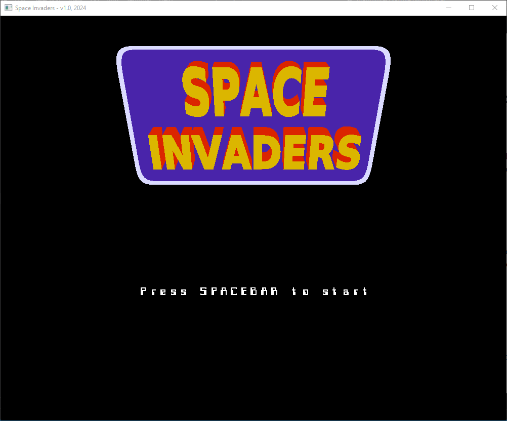

## Space Invaders Game and Gaming Pad

#### Motivation 

I built this project to reinforce my learning on computer graphics with C/C++ and writing interfaces with external hardware like gaming pads. I happened to have a 'damaged' gaming pad in my junk box. Been building simple openFrameworks projects so interfacing with a hacked gaming pad seemed like a nice project for a start.




#### How it works

##### Gaming pad 

This gaming pad utilizes two analog sticks of the pad as the other buttons were pretty damaged. So I reverse engineered the sticks, extracted the connections to X and Y axes and push buttons and glued everything together on a perf-board. 

###### Broken gaming pad


###### Re-constructed gaming pad

The re-constructed gaming pad looks as below: 


#### Gaming pad schematic

Most gaming pads feature two analog sticks and some pressure push buttons. The analog sticks are made of two potentiometers that output  voltage values based on their resistance (position). The pressure push buttons are reactive to user-press. The stronger the user presses the button, the less the resistance, therefore more current passes through that circuitry and it is interpreted appropriately.

You can read more about gaming pads electronics here: https://scholar.valpo.edu/cgi/viewcontent.cgi?article=1004&context=stja . Note that push buttons located on the analog sticks are not pressure sensitive.

The below schematic shows how I simply interfaced the two analog sticks of the broken pad with an ESP-DEVKIT and utilized its ADC to extract the potentiometer values, and button presses: 


##### Gaming pad software interface 

I needed to write some sort of a 'driver' to this simple gaming pad to allow interfacing with the firmware. The needed functions were:

1. Read the state of the push buttons for left and right sticks
2. Read the X and Y axes values for the left and right sticks

This equated to creating an instance for each stick - left and right. The 'class' definition look as as below:

This code is located in the ```main.c``` file in ```gaming-pad-OF\src``` folder.

```C
/* struct to create an instance of a gaming pad */
typedef struct analog_pad {

    uint8_t switch_pin;                 // switch pin
    uint8_t x_val;                      // x-xis potentiometer analog value
    uint8_t y_val;                      // y-axis potentiometer analog value
    uint8_t sw_state;                   // state of the push button - whether presed or not
    adc_channel_t x_adc_channel;        // channel to use for x potentiometer
    adc_channel_t y_adc_channel;        // channel to use for y potentiometer

    /* returns a void - used to init an analog pad instance*/
    void (*init) (struct analog_pad* self, uint8_t switch_pin, adc1_channel_t x_adc_channel, adc_channel_t y_adc_channel); 

    /* get the analog value of the x-axis potentiometer */
    uint32_t (*get_x_val) (struct analog_pad*);        

    /* get the analog value of the y-axis potentiometer */
    uint32_t (*get_y_val) (struct analog_pad*); 

    /* check if button has been pressed */
    uint8_t (*is_button_pressed) (struct analog_pad*);

} AnalogPad;
```

The corresponding member functions are implemented below:

```c

/* member functions to AnalogPad struct */

 /* init an analog pad instance*/
void initPad(AnalogPad* self, uint8_t switch_pin, adc1_channel_t x_adc_channel, adc_channel_t y_adc_channel) {

    // bind pin numbers and adc channel
    self->switch_pin = switch_pin;
    self->x_adc_channel = x_adc_channel;
    self->y_adc_channel = y_adc_channel;

    // init hardware register masks
    #define GPIO_SWITCH_MASK (1 << self->switch_pin)

    // init the x-axis potentiometer
    adc1_config_width(ADC_WIDTH_BIT_10);
    adc1_config_channel_atten(self->x_adc_channel, ADC_ATTEN_DB_11);

    // init the y-axis potentiometer
    adc1_config_width(ADC_WIDTH_BIT_10);
    adc1_config_channel_atten(self->y_adc_channel, ADC_ATTEN_DB_11);

    // init the push button pin
    gpio_config_t io_conf;
    io_conf.mode = GPIO_MODE_INPUT;
    io_conf.pin_bit_mask = GPIO_SWITCH_MASK;
    io_conf.intr_type = GPIO_INTR_DISABLE;
    io_conf.pull_up_en = 1;
    gpio_config(&io_conf);
    
    printf("HW initialization done\n");

}

/* get the analog value of the x-axis potentiometer */
uint32_t get_x_val (struct analog_pad* self) {

    uint32_t val;
    val = adc1_get_raw(self->x_adc_channel);

    return val;

}

/* get the analog value of the y-axis potentiometer */
uint32_t get_y_val (struct analog_pad* self) {

    uint32_t val;
    val = adc1_get_raw(self->y_adc_channel);

    return val;

}

/* check if button has been pressed */
uint8_t is_button_pressed(struct analog_pad* self) {
    
    int64_t previous_time = 0, current_time=0;
    uint8_t button_state = 0;

    // get button reading
    uint8_t reading = gpio_get_level(self->switch_pin);

    // debounce the push button
    if(button_state != reading) {
        current_time = CONVERT_TO_MILLIS(esp_timer_get_time());
        if( (current_time - previous_time) > DEBOUNCE_TIME) {
            // check again
            if(button_state != reading) {
                // button has been actually pressed
                button_state = reading;
            }
        }

        // update time last read
        previous_time = current_time;
    }
    
    return button_state;

}
```

The above code simulates OOP in C using structs.


#### Game logic and graphics

The code for the game is located in the ```SpaceInvaders-gaming-pad/src``` folder.

I followed the openFrameworks article on writing a game to spawn some parts of the game codebase. Then I wrote an interface to read the serial port on which the gaming pad is connected to using ```ofSerial```. Most of the logic, drawing, and updating the screen is discussed in the link provided in the ```References ``` section below.

### How to build and run the game 


1. Make sure you have openFrameworks  set up on your machine. You can check out how to do that on https://openframeworks.cc/

2. Download this repo as a zip file.

3. Extract the zip archive into a new folder. In the new folder, you will find a folder named ``` SpaceInvaders-gaming-pad```. Copy it into the ```apps\myApps``` folder in your openFrameworks installation

4. cd into the ```SpaceInvaders-gaming-pad``` in ```myApps\apps``` folder.

5. Run ```msys2``` terminal. You should have set it up in step 1 above. 

6. in the terminal, run the following command:

   ```$> make```

7. It will take some time to build and compile

8. Once finished, run:

   ```$> make RunRelease```

   

### References

1. Game splash screen : https://www.google.com/url?sa=i&url=https%3A%2F%2Fgithub.com%2Fflightcrank%2Fspace-invaders&psig=AOvVaw2sGXSs8_Zt1q-g28Koeaky&ust=1714921605528000&source=images&cd=vfe&opi=89978449&ved=0CBQQjhxqFwoTCNDly_qi9IUDFQAAAAAdAAAAABAE

2. OpenFrameworks: https://openframeworks.cc/

3. OF hardware: https://openframeworks.cc/ofBook/chapters/hardware.html

4. OF Serial: https://openframeworks.cc/documentation/communication/ofSerial/#:~:text=Reads%20and%20returns%20a%20single,is%20%25d%22%2C%20myByte)%3B

5. Gaming Pad Electronics(PDF): https://scholar.valpo.edu/cgi/viewcontent.cgi?article=1004&context=stja

6. OpenFrameworks Experimental game design: https://openframeworks.cc/ofBook/chapters/game_design.html

   